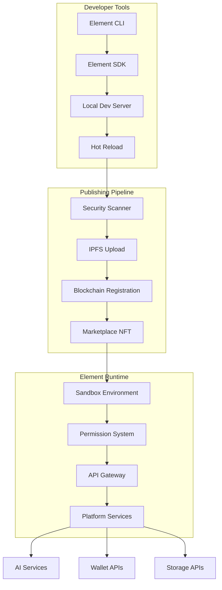

# 🧩 DEFAI Elements SDK

<div align="center">
  
  
  **Build, Deploy, and Monetize AI-Powered Elements for the DEFAI Ecosystem**
  
  [](https://www.npmjs.com/package/@defai/element-sdk)
  [](https://www.npmjs.com/package/@defai/element-cli)
  [](LICENSE)
</div>

---

## 🌟 Welcome Developers & Projects!

Transform your ideas into powerful, monetizable elements within the DEFAI workspace ecosystem. Our Elements SDK empowers developers to create sophisticated AI-powered components that users can seamlessly integrate into their workspaces while generating sustainable revenue streams.

### Why Build with DEFAI Elements?

- 🚀 **Rapid Development** - Pre-built templates and scaffolding get you started in minutes
- 💰 **Built-in Monetization** - Sell elements as Semi-Fungible Tokens (SFTs) on our marketplace  
- 🔒 **Secure Sandbox** - Run in isolated environments with granular permission controls
- 🤖 **AI-First** - Native integration with AI agents and blockchain services
- 🎨 **React Ecosystem** - Build with familiar tools and modern frameworks
- 📈 **Analytics & Insights** - Track usage, performance, and revenue in real-time

---

## 📑 Table of Contents

1. [Quick Start](#-quick-start)
2. [Installation](#-installation) 
3. [Element Architecture](#-element-architecture)
4. [Development Workflow](#-development-workflow)
5. [SDK Reference](#-sdk-reference)
6. [Publishing & Monetization](#-publishing--monetization)
7. [Examples & Templates](#-examples--templates)
8. [Support & Community](#-support--community)

---

## ⚡ Quick Start

Get your first element running in under 5 minutes:

### 1. Install the CLI

**Option A: Homebrew (Recommended for macOS)**
```bash
brew install defai
```

**Option B: npm**
```bash
npm install -g @defai/element-cli
```

### 2. Create Your First Element

```bash
# Create a new element project
defai-element create my-trading-bot --template react

# Navigate to project
cd my-trading-bot

# Install dependencies  
npm install

# Start development server with hot reload
defai-element dev
```

### 3. Preview & Publish

```bash
# Build for production
defai-element build

# Validate your element
defai-element validate

# Publish to the marketplace
defai-element publish --price 100 --tier bronze
```

---

## 📦 Installation

### Prerequisites

- **Node.js 16+** and npm/yarn
- **Solana wallet** with DEFAI tokens for publishing
- **Basic knowledge** of React/TypeScript

### Development Environment Setup

```bash
# Install DEFAI CLI globally
brew install defai
# OR
npm install -g @defai/element-cli

# Install core SDK packages
npm install @defai/element-sdk @defai/element-react @defai/element-types

# Verify installation
defai-element --version
```

### Available NPM Packages

Our comprehensive package ecosystem supports every aspect of element development:

```bash
# Core Development
npm install @defai/element-sdk        # Core SDK and base classes
npm install @defai/element-react      # React hooks and components  
npm install @defai/element-types      # TypeScript definitions

# Development Tools
npm install -g @defai/element-cli     # CLI for scaffolding and publishing
npm install @defai/element-templates  # Pre-built element templates
npm install @defai/element-testing    # Testing utilities and mocks

# Advanced Features
npm install @defai/element-validator  # Code validation and security checks
```

---

## 🏗️ Element Architecture

DEFAI Elements are modular, AI-powered components that run in secure sandbox environments within user workspaces. They can integrate with blockchain services, AI agents, and external APIs while maintaining strict security boundaries.

### Core Components



### Key Features

- **🔐 Secure Execution**: All elements run in isolated sandboxes with controlled API access
- **💎 NFT-Based Ownership**: Elements are minted as SFTs through the `defai_app_factory` program
- **🔄 Real-time Communication**: Elements can communicate with each other and external services
- **📊 Rich Platform APIs**: Access wallet, AI, storage, notifications, and pricing data
- **🎨 Flexible UI**: Responsive components that adapt to workspace themes and layouts

---

## 💻 Development Workflow

### Project Structure

When you create a new element, you'll get a well-organized project structure:

```
my-trading-bot/
├── manifest.json          # Element metadata and configuration
├── package.json           # Dependencies and build scripts
├── tsconfig.json          # TypeScript configuration
├── src/
│   ├── index.tsx          # Main element component
│   ├── components/        # React components
│   ├── hooks/             # Custom React hooks
│   ├── services/          # API integrations
│   └── styles.css         # Element styling
├── assets/                # Images, icons, fonts
├── tests/                 # Unit and integration tests
├── public/
│   └── index.html         # Development HTML template
└── dist/                  # Build output (auto-generated)
```

### Element Manifest

The `manifest.json` file defines your element's metadata, permissions, and marketplace settings:

```json
{
  "id": "my-trading-bot",
  "name": "AI Trading Assistant",
  "version": "1.0.0",
  "description": "Intelligent trading bot with real-time market analysis",
  "author": "Your Name",
  "category": "trading",
  "icon": "chart-line",
  "tierRequired": "bronze",
  "price": 150,
  "royalty": 10,
  "defaultSize": {
    "width": 500,
    "height": 400
  },
  "permissions": {
    "wallet": true,
    "network": true,
    "ai": true,
    "storage": true,
    "notifications": true
  }
}
```

### Basic Element Structure

```typescript
// src/index.tsx
import React, { useEffect, useState } from 'react';
import { DefaiElement, ElementProps, useElementAPI } from '@defai/element-sdk';

export default class TradingBot extends DefaiElement {
  async onCreate() {
    // Initialize element state and services
    console.log('Trading bot element created');
  }

  async onMount() {
    // Element mounted to workspace
    this.startMarketDataStream();
  }

  render() {
    return <TradingBotComponent {...this.props} />;
  }

  private startMarketDataStream() {
    // Access platform APIs through the sandbox
    this.api.prices.subscribe('SOL-USD', (data) => {
      this.setState({ currentPrice: data.price });
    });
  }
}

// React component with hooks
function TradingBotComponent({ elementId }: ElementProps) {
  const { wallet, ai, storage } = useElementAPI();
  const [trades, setTrades] = useState([]);

  useEffect(() => {
    // Load user's trading history
    storage.get('trades').then(setTrades);
  }, []);

  const executeTrade = async (signal: TradeSignal) => {
    if (await wallet.requestPermission('transaction')) {
      // Execute trade through wallet API
      const result = await wallet.sendTransaction(signal.transaction);
      
      // Log trade with AI for analysis
      await ai.analyze('trade-performance', {
        signal,
        result,
        timestamp: Date.now()
      });
    }
  };

  return (
    <div className="trading-bot">
      <h3>AI Trading Assistant</h3>
      {/* Your trading interface */}
    </div>
  );
}
```

---

## 🛠️ SDK Reference

### Core APIs Available to Elements

```typescript
interface ElementAPI {
  // Wallet Integration
  wallet: {
    getAddress(): Promise<string>;
    getBalance(token?: string): Promise<number>;
    sendTransaction(tx: Transaction): Promise<string>;
    requestPermission(action: string): Promise<boolean>;
  };

  // AI Services
  ai: {
    chat(message: string, context?: any): Promise<string>;
    analyze(model: string, data: any): Promise<any>;
    generate(prompt: string, options?: any): Promise<string>;
  };

  // Data Storage
  storage: {
    get(key: string): Promise<any>;
    set(key: string, value: any): Promise<void>;
    delete(key: string): Promise<void>;
    list(prefix?: string): Promise<string[]>;
  };

  // Real-time Data
  prices: {
    get(symbol: string): Promise<PriceData>;
    subscribe(symbol: string, callback: (data: PriceData) => void): void;
    unsubscribe(symbol: string): void;
  };

  // Notifications
  notifications: {
    show(message: string, type?: 'info' | 'success' | 'warning' | 'error'): void;
    request(title: string, body: string): Promise<boolean>;
  };

  // Element Communication
  messaging: {
    send(elementId: string, message: any): Promise<void>;
    broadcast(channel: string, message: any): Promise<void>;
    subscribe(channel: string, callback: (message: any) => void): void;
  };
}
```

### React Hooks

```typescript
import { useElementAPI, useElementState, useElementTheme } from '@defai/element-react';

function MyComponent() {
  const { wallet, ai, storage } = useElementAPI();
  const [state, setState] = useElementState({ count: 0 });
  const { theme, isDark } = useElementTheme();

  // Your component logic
}
```

---

## 📈 Publishing & Monetization

### Development Commands

```bash
# Validate element before publishing
defai-element validate --strict

# Run security audit
defai-element validate --security-only

# Build optimized version
defai-element build --analyze

# Test in production-like environment
defai-element test --e2e
```

### Publishing Process

```bash
# Login to your developer account
defai-element login

# Publish to marketplace
defai-element publish \
  --tier bronze \
  --price 100 \
  --royalty 15 \
  --description "Advanced AI trading bot with portfolio management"

# Check publishing status
defai-element stats my-trading-bot
```

### Monetization Tiers

| Tier | Min Price | Features | Target Users |
|------|-----------|----------|--------------|
| **Free** | 0 DEFAI | Basic functionality | All users |
| **Bronze** | 50 DEFAI | Enhanced features | Active users |
| **Silver** | 200 DEFAI | Premium integrations | Professional users |
| **Gold** | 500 DEFAI | Advanced AI models | Power users |
| **Titanium** | 1000 DEFAI | Enterprise features | Institutional users |

### Revenue Streams

- **💰 Initial Sales**: Earn tokens when users purchase your elements
- **🔄 Royalties**: Receive ongoing payments on secondary sales (up to 20%)
- **📊 Usage Analytics**: Track adoption and optimize for higher engagement
- **🎯 Premium Features**: Offer subscription-based enhancements

---

## 🎨 Examples & Templates

### Available Templates

```bash
# Create different types of elements
defai-element create my-widget --template react        # React component
defai-element create my-chart --template chart         # Data visualization  
defai-element create my-game --template game           # Interactive game
defai-element create my-trader --template trading      # Trading interface
defai-element create my-dashboard --template vue       # Vue.js component
defai-element create my-tool --template vanilla        # Pure JavaScript
```

### Popular Element Categories

- **🤖 AI Agents** - Chatbots, assistants, content generators
- **📊 Trading Tools** - Portfolio trackers, signal analyzers, automated traders  
- **🎮 Games & Entertainment** - Casual games, puzzles, interactive content
- **📈 Analytics Dashboards** - Data visualization, performance metrics
- **🔧 Productivity Tools** - Task managers, calculators, converters
- **💬 Communication** - Chat widgets, social feeds, collaboration tools

---

## 🚀 Build Instructions

### Local Development

```bash
# Clone your element project
git clone https://github.com/yourusername/my-element.git
cd my-element

# Install dependencies
npm install

# Start development server (with hot reload)
npm run dev
# OR using CLI
defai-element dev --port 3000 --open

# Run tests in watch mode
npm run test:watch
# OR using CLI  
defai-element test --watch --coverage
```

### Production Build

```bash
# Create optimized build
npm run build
# OR using CLI with analysis
defai-element build --analyze --source-maps

# Validate the build
defai-element validate --strict

# Test the production build locally
defai-element serve dist/
```

### Continuous Integration

```yaml
# .github/workflows/element-ci.yml
name: Element CI/CD

on: [push, pull_request]

jobs:
  test:
    runs-on: ubuntu-latest
    steps:
      - uses: actions/checkout@v3
      - uses: actions/setup-node@v3
        with:
          node-version: '18'
      
      - name: Install DEFAI CLI
        run: npm install -g @defai/element-cli
      
      - name: Install dependencies
        run: npm ci
      
      - name: Run tests
        run: defai-element test --coverage
      
      - name: Validate element
        run: defai-element validate --strict
      
      - name: Build production
        run: defai-element build
        
      - name: Publish (on main branch)
        if: github.ref == 'refs/heads/main'
        run: defai-element publish
        env:
          DEFAI_API_KEY: ${{ secrets.DEFAI_API_KEY }}
```

---

## 📚 Advanced Features

### Element Communication

```typescript
// Subscribe to messages from other elements
this.api.messaging.subscribe('price-alerts', (alert) => {
  if (alert.symbol === this.state.watchedSymbol) {
    this.showNotification(alert.message);
  }
});

// Broadcast data to other elements
this.api.messaging.broadcast('trade-executed', {
  symbol: 'SOL-USD',
  amount: 100,
  price: 85.50,
  timestamp: Date.now()
});
```

### AI Integration Examples

```typescript
// Analyze market sentiment
const sentiment = await this.api.ai.analyze('sentiment', {
  text: newsHeadlines.join(' '),
  symbol: 'SOL'
});

// Generate trading insights
const insights = await this.api.ai.generate(
  'Generate 3 key insights about SOL price action',
  { temperature: 0.7, maxTokens: 150 }
);

// Chat with AI assistant
const response = await this.api.ai.chat(
  'What are the best DeFi strategies for today?',
  { context: this.state.portfolio }
);
```

### Advanced Storage Patterns

```typescript
// Store complex data structures
await this.api.storage.set('user-preferences', {
  theme: 'dark',
  notifications: true,
  defaultSlippage: 0.5,
  favoriteTokens: ['SOL', 'USDC', 'DEFAI']
});

// Implement caching with TTL
const cacheKey = `price-data-${symbol}`;
const cached = await this.api.storage.get(cacheKey);
if (cached && Date.now() - cached.timestamp < 60000) {
  return cached.data;
}
```

---

## 🔧 Debugging & Testing

### Development Tools

```bash
# Enable verbose logging
defai-element dev --verbose

# Debug specific features
defai-element dev --debug-api --debug-permissions

# Profile performance
defai-element dev --profile

# Test in different themes
defai-element dev --theme dark --theme light
```

### Testing Strategies

```typescript
// Unit tests with mocked APIs
import { mockElementAPI } from '@defai/element-testing';

describe('TradingBot', () => {
  beforeEach(() => {
    mockElementAPI({
      wallet: { getBalance: jest.fn(() => Promise.resolve(1000)) },
      prices: { get: jest.fn(() => Promise.resolve({ price: 85.50 })) }
    });
  });

  test('should display current balance', async () => {
    // Your test logic
  });
});
```

---

## 🌐 Support & Community

### Getting Help

- **📖 Documentation** - [docs.defai.com/elements](https://docs.defai.com/elements)
- **💬 Discord Community** - [discord.gg/defai](https://discord.gg/defai)
- **🐛 GitHub Issues** - [github.com/defaiza/element-sdk/issues](https://github.com/defaiza/element-sdk/issues)
- **📧 Developer Support** - developers@defai.com

### Contributing

We welcome contributions from the community! Whether you're fixing bugs, adding features, or creating new templates:

1. Fork the repository
2. Create a feature branch
3. Make your changes
4. Add tests and documentation
5. Submit a pull request

### Developer Resources

- **📊 Marketplace Analytics** - Track your element performance
- **🎓 Video Tutorials** - Step-by-step guides for complex features
- **🔧 API Reference** - Complete documentation of all available APIs
- **🎨 Design Guidelines** - Best practices for element UI/UX
- **💡 Example Gallery** - Showcases of successful elements

---

## 🚀 Start Building Today!

Ready to create your first DEFAI element? The possibilities are endless:

```bash
# Quick start with our most popular template
defai-element create my-awesome-element --template trading

# Join the ecosystem and start earning
defai-element publish --tier bronze --price 100
```

**Join thousands of developers building the future of decentralized workspaces with DEFAI Elements.**

---

<div align="center">
  <p><strong>Made with ❤️ by the DEFAI Community</strong></p>
  <p>
    <a href="https://defai.com">Website</a> • 
    <a href="https://docs.defai.com">Docs</a> • 
    <a href="https://discord.gg/defai">Discord</a> • 
    <a href="https://twitter.com/defaiza">Twitter</a>
  </p>
</div> 